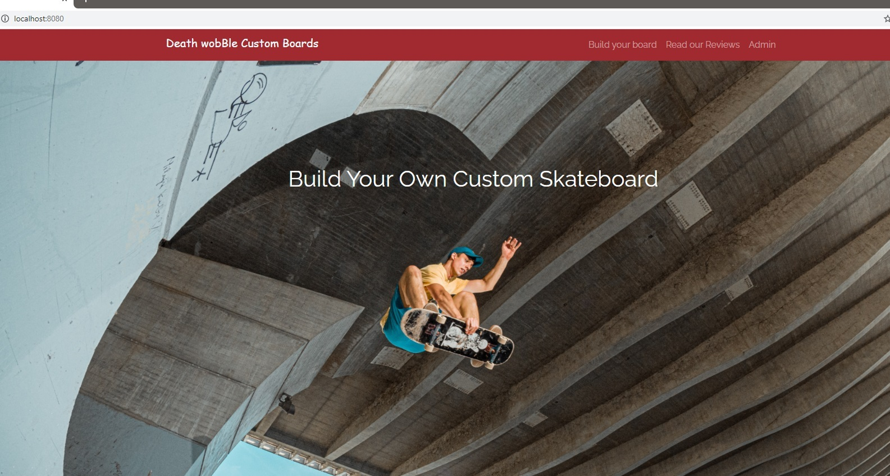

# **BUILD-A-BOARD**

A marketplace for building a custom skateboard.  Select from multiple types of decks, wheels, trucks, and bearings.  Customize your skateboard with grip tape designs.

## Table of Contents
[General Information](#generalinformation) \
[Screenshot](#screenshot) \
[Technology](#technology) \
[Setup](#setup) \
[Features](#features) \
[Contributors](#contributors)

## General Information
In addition to customizing skateboards, the website allows the user to generate invoices and have an email sent with an attached PDF.  This is a client facing application deployed through heroku with a mySQL database backend.

## Screenshot

## Technology
#### Express
#### Handlebars
#### mySQL
#### Heroku

### npmjs packages
- passport
- nice invoice
- sendgrid
- sequelize

## Setup
web address

## Features
    Fulll Stack Application
    mySQL backend database
    invoice generator utilizing nice invoice npm package
    emails generated through sendgrid npm package

## Contributors
Mike Kolek  https://github.com/mkolek1015 \
Jay Chapman https://github.com/jaychapman \
Edward Borden https://github.com/eaborden
